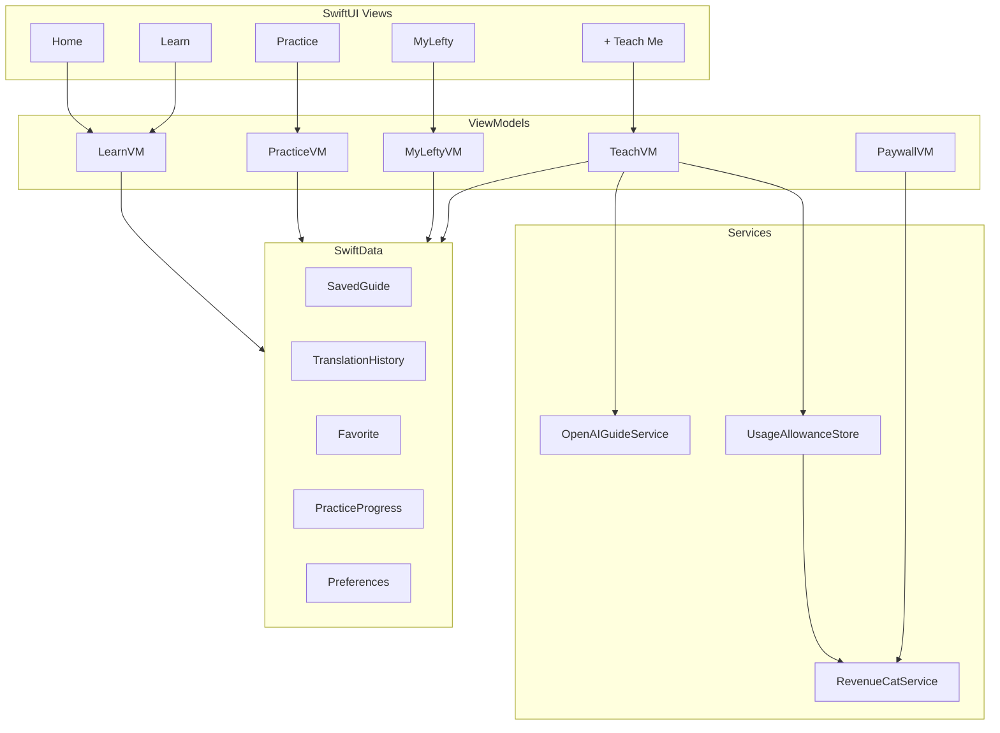

# Lefty MVP Build Plan

**Repo:** [github.com/voliwoki/lefty](https://github.com/voliwoki/lefty)  
**Tagline:** Same world. Just left.  
**Stack:** Swift · SwiftUI · SwiftData · RevenueCat · OpenAI (vision) · iPhone  

Greenfield SwiftUI + SwiftData iOS app built to the written Lefty **App Spec** (not the social/ecommerce mockups), with **left-hand–friendly UI** (primary controls biased left). Must-haves ship Show → Translate → Learn → Save with RevenueCat; nice-to-haves deepen Practice, polish, and content if time remains.

---

## Source of truth

- **Features & nav:** written App Spec only — **Home · Learn · + · Practice · My Lefty**. No Wall, Products, accounts, cart, or public profiles (mockups are visual reference only).
- **Look:** soft lavender backgrounds, white cards, coral/orange primary CTA, yellow accents, rounded friendly type — from the mockups, applied to spec screens.
- **Left-hand UI:** the app itself is lefty-friendly — primary actions, toolbars, and step controls sit on the **left** (thumb-reach), not the usual right-handed iOS defaults. See dedicated section below.
- **AI default:** OpenAI vision + structured JSON responses (API key in app config for Shipaton MVP). No custom backend.
- **Repo base:** Xcode template — `lefty/leftyApp.swift`, `lefty/ContentView.swift` — bundle ID `com.knk.lefty`, iOS 26.5.

---

## External services & data (what we use / don’t use)

### On-device only (not a cloud database)

| What | How |
|------|-----|
| Saved guides, favorites, translation history, practice progress, preferences, free Teach allowance | **SwiftData** on the iPhone |
| Curated Learn guides + tip pool | Bundled **JSON** in the app binary |

There is **no** server database, no Firebase/Supabase, no user sync, no accounts.

### External services we call

| Service | Why | When data leaves the device |
|---------|-----|-----------------------------|
| **OpenAI** (vision + chat, structured JSON) | Teach Me Left-Handed: photo/screenshot/text → left-handed guide | Only when user taps Teach — image and/or instruction text sent to OpenAI; discard source image locally after generate when possible |
| **RevenueCat** (+ App Store / StoreKit) | Lefty+ subscriptions, entitlements, restore | Purchase/restore flows; anonymous RC user id (no email/login we build) |
| **Apple system APIs** | Camera, PhotosPicker, ShareLink, haptics | Stay on-device except share target the user picks |

### Not in MVP

- Custom backend, auth, community DB, analytics SDKs (unless Shipaton later requires something minimal), ad networks.

### Secrets / config you’ll need

- OpenAI API key (app config for Shipaton; document in privacy policy that Teach content is processed by an AI provider).
- RevenueCat API key + products (`monthly` / `annual`) + entitlement `lefty_plus`.
- Hosted **Privacy Policy** + **Terms** URLs (can be simple static pages).

---

## Age 13+, who pays, Family Controls, OpenAI

### Do we need Family Controls / Screen Time APIs?

**No.** Apple’s **FamilyControls** / Managed Settings frameworks are for *parental-control / Screen Time* apps (blocking apps, limits, device supervision). Lefty is a learning app rated **13+**, not a parental-control product and **not** in the Kids Category.

What we do instead:

- App Store age rating **12+** or **13+** (content-appropriate; not Kids Category).
- No accounts, no social, no ads — reduces COPPA/Kids complexity.
- Privacy nutrition labels + policy disclosing OpenAI processing of Teach inputs.

### Who pays for Lefty+?

**Whoever owns the Apple ID that completes the App Store purchase** — StoreKit/RevenueCat handle it; we do not collect parent/teen payment info.

Typical cases:

- Teen with their own Apple ID + payment method / allowance → teen’s ID is charged.
- Family Sharing / Ask to Buy → **parent/guardian** approves or pays; teen gets access on their device.
- Enable **Apple Family Sharing** for the subscription products in App Store Connect / RevenueCat when configuring Lefty+ so a parent can buy once for the family.

We do **not** build “parent account vs kid account” in-app (no auth). Optional later: a short first-launch note that under-18 users should have a parent/guardian’s permission (aligns with OpenAI’s terms).

### Can we use OpenAI if teens use the app?

**Yes for 13+**, with constraints. OpenAI allows API use for minors with safeguards; it is **not** “banned for kids,” but:

| Rule | What it means for Lefty |
|------|-------------------------|
| **Under 13 / digital-consent age** | Do **not** process personal data of under-13s via OpenAI without approved **Zero Data Retention** (and legal parental consent). Spec targets **13+** — stay out of Kids Category and don’t market as for under-13. |
| **Under 18** | Parent/guardian permission expected (OpenAI business terms). Disclose AI use in privacy policy / first Teach use. |
| **Safety** | Age-appropriate content; refuse/high-risk prompt rules; encourage photos of **instructions/objects**, not faces/bodies. |
| **Data** | Prefer not retaining source images; minimize PII in prompts; privacy policy must say Teach content is sent to OpenAI. |

**MVP stance:** OpenAI is OK for Shipaton **13+** with disclosure, safety prompts, no under-13 positioning, and no face/selfie flows. If you later target under-13 or Kids Category, OpenAI + ZDR + parental consent becomes a much heavier path — out of scope.

See also: [OpenAI Under 18 API Guidance](https://developers.openai.com/api/docs/guides/safety-checks/under-18-api-guidance).

---

## Left-hand friendly UI (must)

This is a product differentiator: Lefty should feel designed for a left thumb holding the phone.

**Layout rules (apply across all screens):**

- **Primary CTAs** (Teach me, Start, Next, Save, Subscribe): left-aligned or left-weighted in the bottom action bar — not trailing/right by default.
- **Step navigation:** `Back` | progress | `Next` with **Next on the left** (or a full-width left-leading Next above a secondary Back), so the dominant action is under the left thumb.
- **Toolbars:** leading placement for primary icons (Save, Share, Favorite, Close). Avoid stuffing the only important action in the trailing slot.
- **List row accessories:** prefer leading icons/chevrons patterns where custom; when using system lists, keep tap targets large and put row actions reachable from the left where we control layout.
- **FABs / floating actions:** bottom-**leading**, not bottom-trailing (override the common Material/iOS right FAB habit).
- **Sheets / paywall close:** Close reachable from the left; primary purchase button left-biased or full-width (full-width is fine — equal reach).
- **Practice canvas:** controls (undo, clear, next letter) clustered on the **left**; drawing area can stay center/full.
- **Thumb zone:** keep primary interactive chrome in the lower-left / lower-center; avoid critical one-handed actions in the top-trailing corner.
- **Minimum 44×44pt** targets; no cramped right-edge-only hit areas.
- Encode as reusable layout helpers in `Design/` (e.g. `LeftyActionBar`, leading-biased `ToolbarItem`s) so screens stay consistent.

**Exceptions:** system `TabView` tab order stays Home · Learn · + · Practice · My Lefty (center + is already the hero). System keyboards stay system. Don’t break VoiceOver order — label and accessibility sort order still read logically (title → content → primary action).

---

## Architecture (MVVM)



**Folder layout under `lefty/`:**

- `App/` — entry, `TabRootView`, model container
- `Models/` — SwiftData `@Model`s + guide DTOs / bundled JSON
- `ViewModels/` — one VM per major flow
- `Views/` — Home, Learn, Teach, Practice, MyLefty, Paywall, shared components
- `Services/` — AI, RevenueCat, camera/photo helpers, haptics
- `Resources/` — bundled Learn guides JSON, tip pool, Color/String catalogs
- `Design/` — tokens (colors, spacing, typography) — no hardcoded values in views

---

## Must-haves (ship for Shipaton)

### M1 — Foundation & design system

- Replace `ContentView` with 5-tab shell; center **+** opens Teach flow (sheet or dedicated nav, visually distinct).
- Color / typography / string catalogs; dark mode via semantic colors.
- **Left-hand layout primitives:** shared `LeftyActionBar`, leading-biased toolbars, bottom-leading secondary actions — used by Home, Teach, Learn, Practice, Paywall.
- SwiftData `modelContainer` in `leftyApp.swift`.
- Info.plist usage strings: Camera, Photo Library (learning materials, not selfies).

### M2 — Home (purpose in seconds)

- Brand + tagline **Same world. Just left.**
- Dominant hero: **What do you want to learn?** → **Teach me left-handed** + Take photo / Upload / Type.
- **Continue learning** only when SwiftData has in-progress guide.
- Horizontal **Popular Lefty Guides** → Learn.
- Rotating **Quick Lefty Tip** from bundled tip list.

### M3 — Teach Me Left-Handed (killer loop)

Screens: Input → Processing → Overview → Step-by-step → Completion.

| Input | Implementation |
|-------|----------------|
| Camera | `UIImagePickerController` / `PhotosUI` camera |
| Upload | `PhotosPicker` |
| Paste / Type | Text editor (not a chat UI) |

- Processing copy: **Making this left-handed…** / Reading… / Finding what changes… / Building…
- Step chrome: progress + **Next/Back left-biased** via `LeftyActionBar` (primary under left thumb).
- `OpenAIGuideService`: multimodal request → **decode strict JSON** into `GeneratedGuide` (title, summary, steps[], changes/same, tips, confidence, safety).
- Prompt encodes critical rules: no blind left/right swap; ask for more info; decline unsafe; contextual adult help.
- Confidence UI: proceed / uncertainty note / need-more-info / decline.
- Save to SwiftData (`TranslationHistory` / `SavedGuide`); discard source image after generate when possible.
- Free allowance: **3 conversions/month** in SwiftData + RevenueCat entitlement bypass when Lefty+.

### M4 — Learn (bundled library)

- Categories from spec; ship **8–12** short curated guides as local JSON (knitting, crochet, writing/smudge, notebook, guitar basics, knots, kitchen, scissors workaround, etc.).
- Category list → guide list → step detail (one step focus, not blog walls).
- Favorite + save; gate full library behind Lefty+ (starter subset free).

### M5 — My Lefty (local only)

- Saved guides, translations kept, favorites, continue learning, simple counts (**things learned / saved / practiced**).
- No edit profile, logout, Wall, or followers.

### M6 — Practice (minimal but real)

- **One** handwriting practice path: letter/stroke tracing with touch path, progress, haptics.
- Progress in SwiftData; free vs Lefty+ content gate.
- Skip knots/craft sequences for must-have if time is tight (see N2).

### M7 — RevenueCat + Lefty+

- SPM: RevenueCat iOS SDK; configure products **monthly / annual**.
- Entitlement e.g. `lefty_plus`.
- Paywall only after free Teach allowance exhausted (not after onboarding).
- Spec copy: benefits, prices, Restore, Terms, Privacy, close — no fake urgency.
- Wire gates: Teach count, Learn fullness, save limits, Practice fullness.
- Enable Family Sharing on subscription products.

### M8 — Safety, privacy, share

- Safety branching in AI schema + local refuse for high-risk topics.
- Minimal privacy policy URL (what happens to Teach images/text).
- `ShareLink` for a generated/saved guide summary.
- Age 13+ positioning; not Kids Category.
- Optional under-18 parent/guardian permission note on first launch.

---

## Nice-to-haves (if time)

| ID | Item |
|----|------|
| N1 | Richer Teach visuals (simple SF Symbol / sketch diagrams per step) |
| N2 | Extra Practice: word tracing, paper-angle coach, knot/craft sequences |
| N3 | Expand Learn to 20+ guides + stronger illustrations |
| N4 | Onboarding (3 screens, purpose only — no paywall) |
| N5 | Settings sheet from My Lefty: appearance preference, notifications toggle (local), Manage Subscription, Help, About |
| N6 | Offline-friendly cached last translation; better error/empty/loading everywhere |
| N7 | Widget or App Intents (“Continue learning”) |
| N8 | RevenueCat Paywalls / Customer Center UI |
| N9 | Accessibility + lefty-UI audit (Dynamic Type, VoiceOver, 44pt targets, left-thumb reach pass on every screen) |
| N10 | Unit tests for allowance math + guide JSON decoding |

---

## Explicitly out of scope (MVP)

Social Wall, ecommerce, accounts/auth, backend, ads, Kids Category, blind mirroring AI, paywall-on-launch, FamilyControls APIs.

---

## Suggested build order

1. Design tokens + **left-hand layout helpers** + tab shell + empty placeholders
2. SwiftData models + My Lefty / Home continue wiring
3. Bundled Learn content + browse/detail/favorite
4. Teach input UI → stub then real OpenAI structured guide → step player → save
5. Usage allowance + RevenueCat + paywall
6. Practice handwriting MVP
7. Polish Home, haptics, share, privacy strings
8. Nice-to-haves in priority N9 → N4 → N5 → N2 → rest

---

## Implementation todos

| ID | Task |
|----|------|
| m1-foundation | Design tokens, left-hand layout rules, 5-tab shell with center +, SwiftData container, privacy Info.plist strings |
| m2-home | Home hero (Teach CTA), continue learning, popular guides, rotating tip — left-biased actions |
| m3-teach | Teach flow (left-biased nav): camera/PhotosPicker/text → OpenAI structured guide → steps → save; confidence/safety |
| m4-learn | Bundled JSON Learn library, category/list/detail, favorites, free vs Lefty+ subset |
| m5-mylefty | My Lefty: saved, translations, favorites, continue, simple progress counts |
| m6-practice | Handwriting tracing Practice MVP with SwiftData progress + haptics |
| m7-revenuecat | RevenueCat SDK, Lefty+ products/entitlement, allowance + paywall on Teach limit |
| m8-safety-share | AI safety, 13+ disclosures, privacy policy (OpenAI), ShareLink; Family Sharing on Lefty+ products |
| n-polish | Nice-to-haves if time: a11y, onboarding, settings, more Practice/Learn, RC Paywalls UI |

---

## Key models (SwiftData)

- `SavedGuide` — id, title, steps JSON, source (learn/teach), createdAt, progress
- `FavoriteGuide` — guideId, createdAt
- `PracticeProgress` — skillId, completedCount, lastAt
- `UserPreferences` — tip index, appearance override
- `UsageMonth` — yearMonth, teachCount

Bundled: `GuideDocument` Codable (not SwiftData) loaded from JSON.

---

## AI contract (sketch)

```swift
struct GeneratedGuide: Codable {
  var title: String
  var estimatedMinutes: Int?
  var summary: String
  var whatChanges: String
  var whatStaysSame: String
  var confidence: Confidence // high | uncertain | needMoreInfo | unsafe
  var clarifyingQuestion: String?
  var steps: [GuideStep]
  var safetyNote: String? // e.g. ask an adult
}
```

---

## Shipaton checklist (must)

- [ ] Working Teach Me Left-Handed with real vision/text
- [ ] Curated Learn starter set
- [ ] Local My Lefty persistence
- [ ] RevenueCat subscribe + restore + entitlement gates
- [ ] Spec navigation and no social/shop
- [ ] Left-hand friendly chrome (primary actions left / left-thumb reach)
- [ ] Privacy policy + camera/photo purpose strings
- [ ] 13+ positioning (not Kids Category); OpenAI use disclosed
